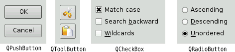
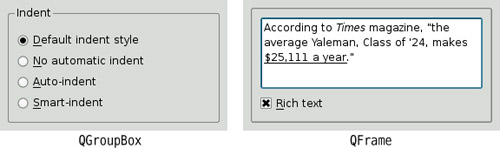
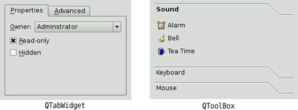
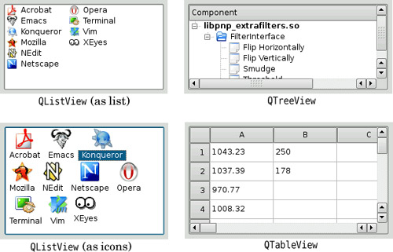
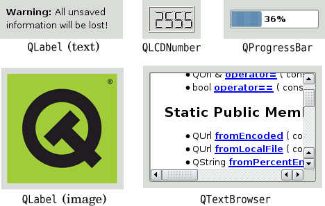
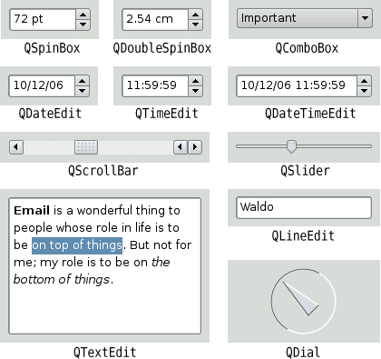
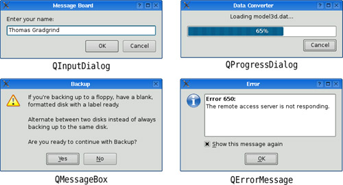
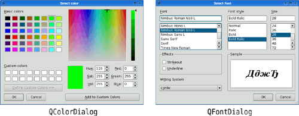
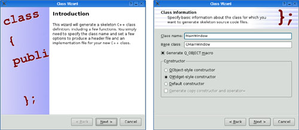
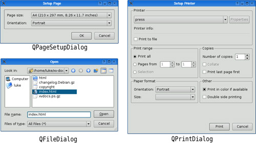

# Qt Designer

## Buddies

A buddy widget accepts the input focus on behalf of a label

- Edit -> Buddies -> "Buddie Edit Mode"
- Edit -> Edit Widgets -> "Exit Buddie Edit Mode"

## Tab Order

Tab order mode enables to give tab order for each widget

- Edit -> Edit Tab order
- Click on the widget to change its tab order
- Once done click Edit -> Edit Widgets -> "Exit Tab Order Mode"

## Form

For each design form a ui c++ class will be generated , if the form name is sortform.ui, then ui_sortform.h will be generate by UIC (user interface compiler)

## Qt Widget Categorization

- Button Widgets
	* QPushButton
	* QToolButton
	* QCheckBox
	* QRadioButton

- Single Page Containers
	* QGroupBox
	* QFrame

- Multi Page Containers
	* QTabWidget
	* QToolBox

- View Widgets
	* QListView
	* QTreeView
	* QTableView

- Display Widgets
	* QLabel
	* QLCDNumber
	* QProgressBar
	* QLabel(Image)
	* QTextBrowser

- Input Widgets
	* QSpinBox
	* QDoubleSpinBox
	* QComboBox
	* QDateEdit
	* QTimeEdit
	* QSlider
	* QScrollBar	
	* QTextEdit
	* QDial

- Feedback Dialogs
	* QInputDialog
	* QProgressDialog
	* QMessageBox
	* QErrorMessage

### Feedback Widgets

### Color Widgets

### Wizard Widgets

### File Print Widgets

